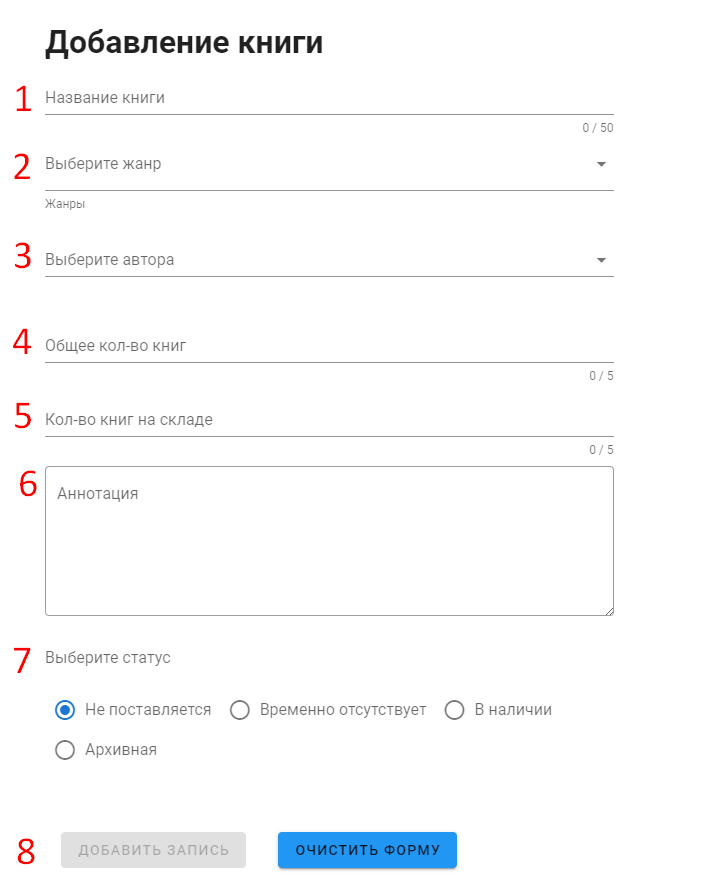
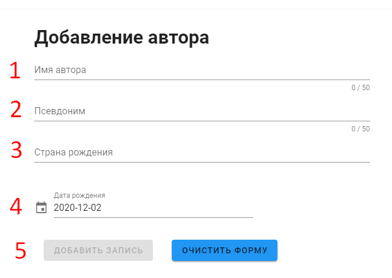
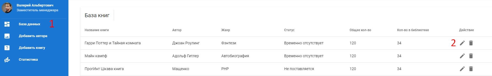
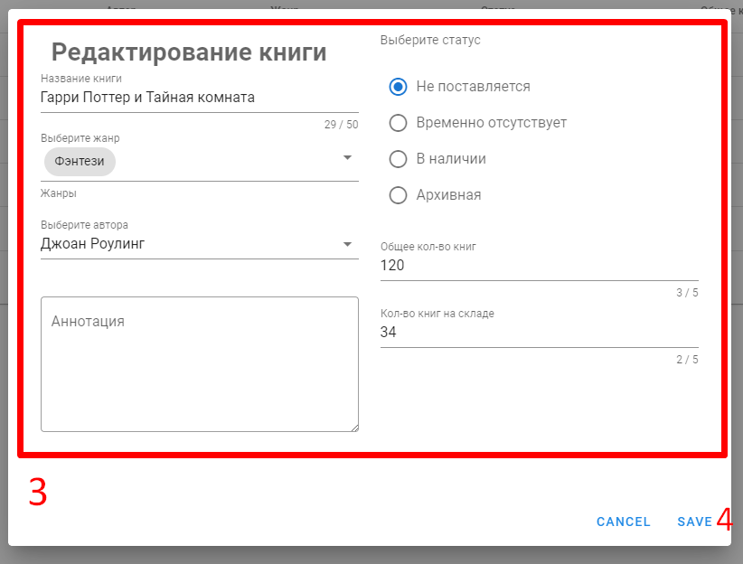
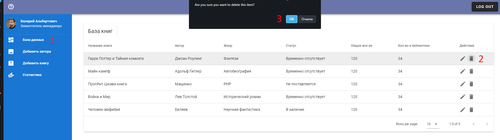
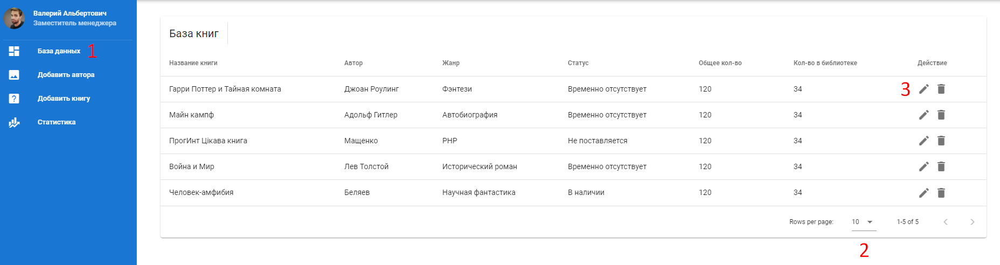
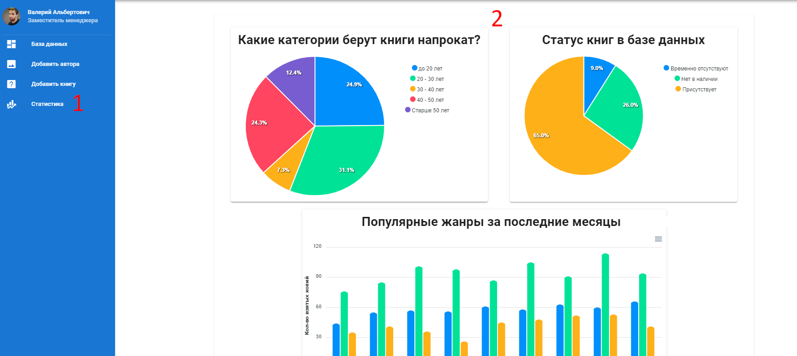

# Справка

[[toc]]

## Вход в аккаунт

1. Нажмите на кнопку `Sign in` в правом верхнем углу
2. В открывшемся окне выберите ваш google аккаунт и нажмите "продолжить"
3. Вы будете перенаправлены на [главную страницу](./glossary.md#аккаунт-и-главное-меню).

## Выход из аккаунта
Нажмите на кнопку `Sign out` в правом верхнем углу

## Добавление книги

Форма предназначена для добавления новой книги в базу данных. Заполните необходимые поля в соответствии с инструкцией ниже:

1. Название книги **`(обязательно)`** :exclamation:
2. [Жанр(ы)](./glossary.md#жанр) книги **`(обязательно)`** :exclamation:
3. [Автор](./glossary.md#автор) книги **`(обязательно)`** :exclamation: 
4. [Общее количество](./glossary.md#количество-книг)книг **`(обязательно)`** :exclamation:
5. [Доступное количество](./glossary.md#количество-книг) книг на складе**`(обязательно)`** :exclamation:
6. [Аннотация](./glossary.md#аннотация) к книге **`(необязательно)`** 
7. [Статус](./glossary.md#статус) книги **`(обязательно)`** :exclamation:
8. После корректного заполнения необходимых полей, станет доступной для нажатия кнопка `Добавить запись`. 

В случае необходимости очистить введенные данные, нажмите [Очистить форму](./glossary.md#очистить-форму)

## Добавление автора

Форма предназначена для добавления нового автора в базу данных. Заполните необходимые поля в соответствии с инструкцией ниже:

1. Имя автора **`(обязательно)`** :exclamation:
2. Псевдоним **`(необязательно)`**
3. Страна рождения **`(обязательно)`** :exclamation: 
4. Дата рождения **`(обязательно)`** :exclamation:
5. После корректного заполнения необходимых полей, станет доступной для нажатия кнопка `Добавить запись`. 

В случае необходимости очистить введенные данные, нажмите [Очистить форму](./glossary.md#очистить-форму)

## Редактирование книги

1. Перейдите на вкладку `базу данных` в [боковом меню](./glossary.md#боковое-меню)
2. Нажмите на :pencil2: иконку у соответствующей книги чтобы перейти в меню редактирования

3. Измените данные в соответствии с требованиями к форме [Добавления книги](./glossary.md#добавление-книги)

4. Нажмите `Save` для сохранения изменений, либо `Cancel` для отмены

## Удаление книги

1. Перейдите на вкладку `базу данных` в [боковом меню](./glossary.md#боковое-меню)
2. Нажмите на :wastebasket: иконку у соответствующей книги чтобы удалить ее
3. Подтвердите свое действие

## Просмотр элементов базы данных

1. Перейдите на вкладку `базу данных` в [боковом меню](./glossary.md#боковое-меню)
2. Чтобы изменить количество отображаемых позиций на странице, выберите необходимое число в выпадающем меню
3. Нажмите на :pencil2: иконку у соответствующей позиции для просмотра
4. Для закрытия формы нажмите `Cancel` либо кликните за пределами формы

## Просмотр статистики

1. Перейдите на вкладку `Статистика` в [боковом меню](./glossary.md#боковое-меню)
2. Просмотр статистики по необходимым пунктам станет доступным

